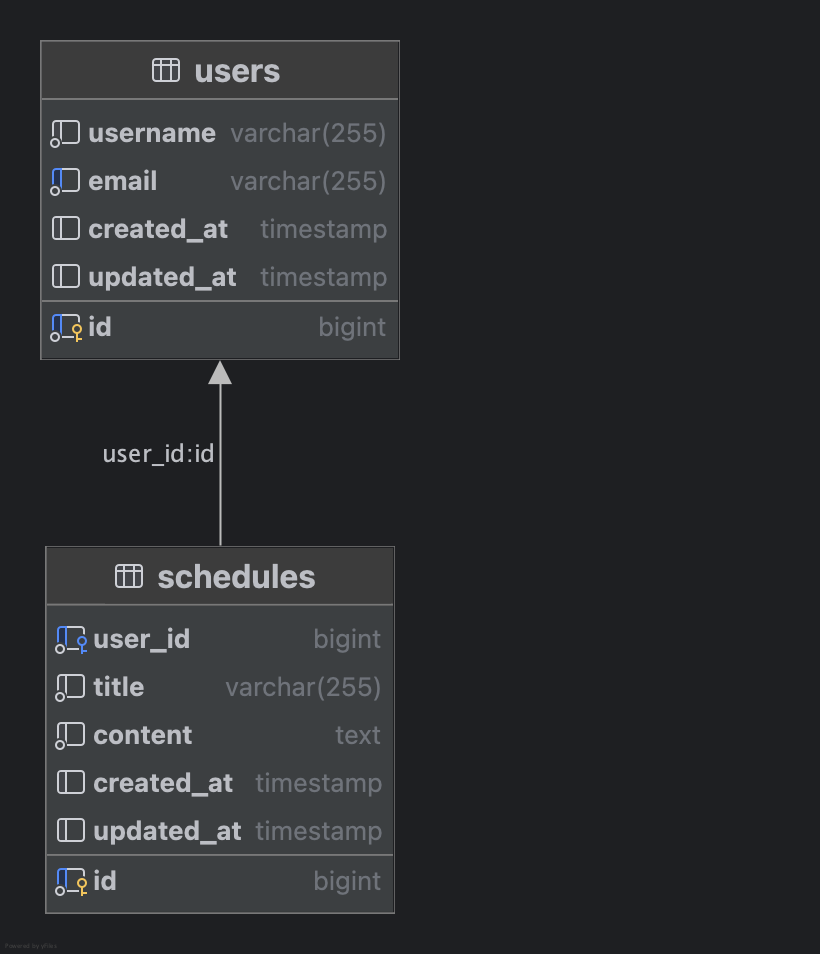

<h1>📌 API 명세서</h1>
------
<h2>📂 일정 API </h2>

-----
📝 일정 생성

POST /api/schedules

✅ Request
````
{
  "userId": 1,
  "title": "회의",
  "content": "회의 내용"
}
````
📤 Response
````
{
  "id": 1,
  "userId": 1,
  "title": "회의",
  "content": "회의 내용",
  "createdAt": "2025-04-04T12:00:00",
  "updatedAt": "2025-04-04T12:00:00"
}
````

-----

📝 전체 일정 조회

GET /api/schedules


📤 Response
````
  {
    "id": 1,
    "userId": 1,
    "title": "회의",
    "content": "회의 내용",
    "createdAt": "2025-04-04T12:00:00",
    "updatedAt": "2025-04-04T12:00:00"
  }
````

-----
📝 일정 단건 조회

GET /api/schedules/{id}


📤 Response
````
{
  "id": 1,
  "userId": 1,
  "title": "회의",
  "content": "회의 내용",
  "createdAt": "2025-04-04T12:00:00",
  "updatedAt": "2025-04-04T12:00:00"
}
````

-----
📝 일정 수정

PUT /api/schedules/{id}

✅ Request
````
{
  "title": "수정된 제목",
  "content": "수정된 내용"
}
````
📤 Response
````
{
  "id": 1,
  "userId": 1,
  "title": "수정된 제목",
  "content": "수정된 내용",
  "createdAt": "2025-04-04T12:00:00",
  "updatedAt": "2025-04-04T13:00:00"
}
````

-----
📝 일정 삭제

DELETE /api/schedules/{id}


📤 Response
````
{
  "message": "삭제 완료"
}
````

-----

<h2>📂 유저 API</h2>

----
📝 유저 생성

POST /api/users

✅ Request
````
{
  "username": "홍길동",
  "email": "hong@example.com"
}
````
📤 Response
````
{
  "id": 1,
  "username": "홍길동",
  "email": "hong@example.com",
  "createdAt": "2025-04-04T12:00:00",
  "updatedAt": "2025-04-04T12:00:00"
}
````

-----
📝 전체 유저 조회

GET /api/users

📤 Response
````
{
    "id": 1,
    "username": "홍길동",
    "email": "hong@example.com",
    "createdAt": "2025-04-04T12:00:00",
    "updatedAt": "2025-04-04T12:00:00"
  }
````

-----
📝 유저 단건 조회

GET /api/users/{id}

📤 Response
````
{
  "id": 1,
  "username": "홍길동",
  "email": "hong@example.com",
  "createdAt": "2025-04-04T12:00:00",
  "updatedAt": "2025-04-04T12:00:00"
}
````

-----
📝 유저 수정

PUT /api/users/{id}


✅ Request
````
{
  "username": "수정된 이름",
  "email": "update@example.com"
}
````
📤 Response
````
{
  "id": 1,
  "username": "수정된 이름",
  "email": "update@example.com",
  "createdAt": "2025-04-04T12:00:00",
  "updatedAt": "2025-04-04T13:00:00"
}
````

-----
📝 유저 삭제

DELETE /api/users/{id}

📤 Response
````
{
  "message": "삭제 완료"
}
````
------
ERD
------



